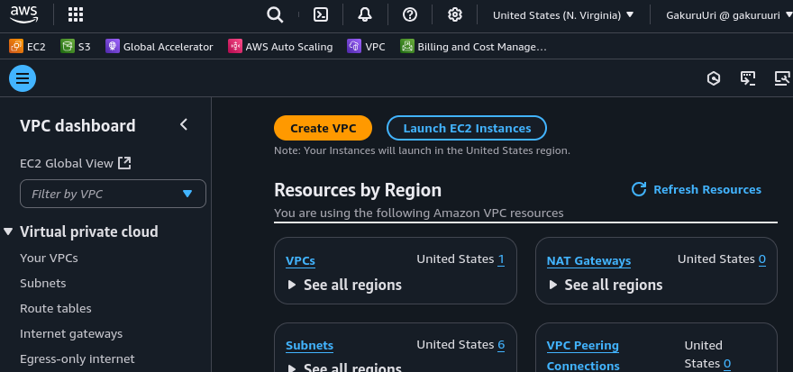
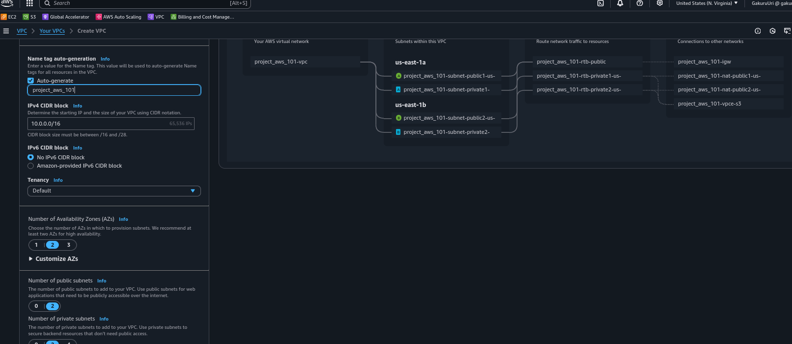

# AWS 101 Workshop

### This is a hands-on project that can be done by anyone even with no experience using Amazon Web Services.

#### By doing this project, one learns core service including
> VirtualNetworks, Security Groups, compute instances, load balancing and storage.

This project covers the fundamental building blocks needed to run a scalable, secure web application on AWS.

```
We'll start by configuring the network environment, then deploy the web server, set up access controls, and integrate cloud storage. Finally, we'll test the end-to-end functionality of the web application and do a clean-up.
```


# Architecture

*Below is the architectural diagram of the project*


## Building a website

```
The goal is to ensure you develop a solid understanding of these fundamental AWS concepts and services. While there may be more efficient ways to host a website on AWS, we're walking through this approach as it's a great way to learn the core building blocks.

Let's get started building your first AWS-powered web application! We'll begin by setting up the network that will host your infrastructure.
```

## 1. Virtual Private Cloud (Networking)



```
An Amazon VPC is a logically isolated virtual network that you define, allowing you to launch AWS resources in a secure, isolated environment. You can use the VPC wizard to set up networking for the web server which include subnets, routing etc
```
> AWS separates public and private subnets - public subnets can access the Internet, while private subnets cannot. The subnets are spread across  Availability Zones

> An Availability Zone is a group of one or more data centers within an AWS Region. Each subnet is contained entirely within a single Availability Zone and cannot span multiple zones.


Each subnet is connected to a route table, which determines how network traffic is routed. The public subnets are routed to an Internet Gateway

> An Internet Gateway is a horizontally scaled, redundant, and highly available VPC component that allows communication between your VPC and the Internet.

> The private subnets are linked to a VPC Endpoint, which is a gateway that provides private connectivity to other AWS services without going through the public internet. This VPC Endpoint will be used to connect the web server in the private subnet to an AWS storage service.

```
The dollar sign next to the NAT Gateway indicates there is a cost for this service 
```

>NAT gateways allows our private web servers to communicate out to the Internet.



## Test your Knowledge

```
1. What is an Availability Zone and why use more than one?

An Availability Zone is a group of one or more data centers within an AWS Region. Using multiple Availability Zones provides redundancy and high availability for your resources, protecting against failures in a single location.
```

```
2. What's the benefit of creating two NAT Gateways?

Deploying two NAT Gateways, one in each Availability Zone, provides redundancy and ensures continued internet access if one NAT Gateway fails.
```
```
3. What's the maximum number of subnets in an Amazon VPC?

The VPC wizard has some limitations, but you can actually create up to 200 subnets per VPC if needed.
```

```
4. When migrating on-premises servers to AWS, what should you consider when choosing subnet CIDR blocks?

When choosing subnet CIDR blocks for your VPC, ensure they don't overlap with your on-premises network to avoid routing conflicts.
```