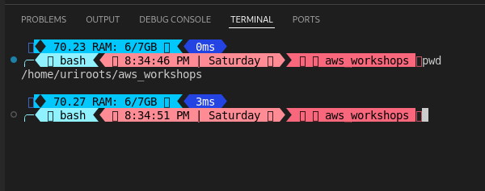

# AWS workshops projects

    These are hands-on, self paced AWS projects under the AWS Workshop studio barner

> For all these projects, I will be using my personal AWS account and should you use the projects as a reference, know that there is a cost aspect to the projects.

> Each project has its own directory under the parent directory, which is under uriroots/aws_workshops

